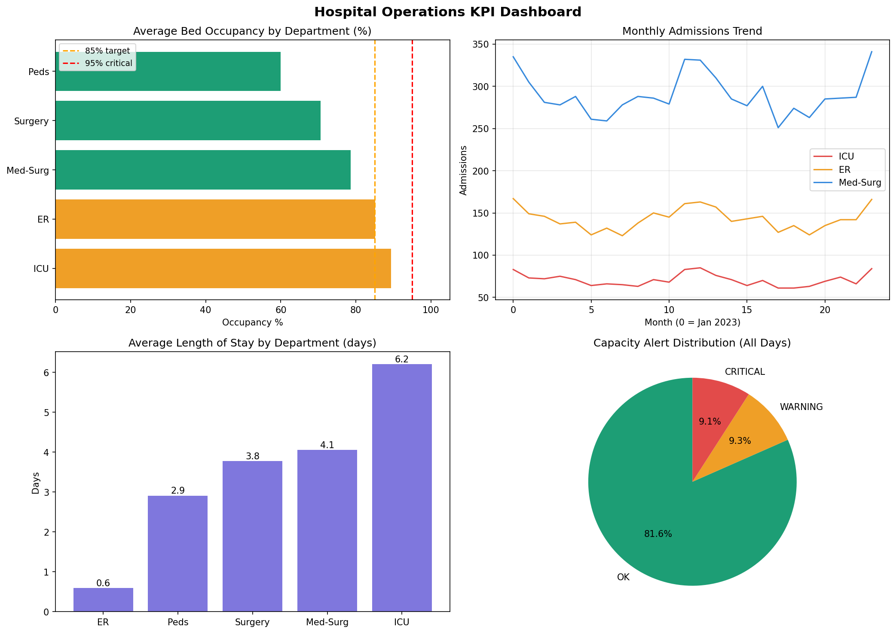

# Hospital Operations KPI Dashboard

## Overview
This project builds a hospital operations KPI dataset and dashboard-ready analytics workflow. It tracks bed occupancy, admissions, discharges, average length of stay, cost per patient day, and capacity alert status.

The project is designed for Healthcare Data Analyst, BI Developer, Data Scientist, and Operations Analytics roles.

## Business Problem
Hospital operations teams need visibility into capacity pressure, patient flow, and resource utilization. A KPI dashboard helps leaders detect overcrowding, monitor trends, and make faster staffing and capacity decisions.

## Dataset Note
This repository uses **synthetic/demo hospital operations data generated inside the Python script**. The structure is inspired by Synthea/AHA-style hospital operations data and can be replaced with real hospital census or operational reporting data.

## Tech Stack
- Python: pandas, numpy, matplotlib
- BI: Power BI-ready CSV and DAX measures
- Analytics: KPI tracking, trend analysis, alert logic

## Repository Structure
```text
project4_hospital_kpis/
├── kpi_pipeline.py           # Generates hospital KPI dataset and charts
├── powerbi_dax.md            # Ready-to-use Power BI DAX measures
├── requirements.txt          # Project-specific Python dependencies
├── results/                  # Saved outputs after running scripts
└── README.md
```

## How to Run in VS Code
Open this folder in VS Code, then run:

```bash
python3 -m venv .venv
source .venv/bin/activate
pip install --upgrade pip
pip install -r requirements.txt
mkdir -p results
```

Run the KPI pipeline:

```bash
python kpi_pipeline.py
mv -f hospital_kpis.csv hospital_kpis.png results/
```

## Outputs
| Output | Description |
|---|---|
| `results/hospital_kpis.csv` | Dashboard-ready hospital operations dataset |
| `results/hospital_kpis.png` | KPI summary charts for occupancy, LOS, admissions, and alerts |
| `powerbi_dax.md` | Power BI measures for occupancy, trend, and alert calculations |

## Sample Visuals


## KPIs Tracked
| KPI | Purpose |
|---|---|
| Occupancy Rate | Tracks bed utilization and capacity pressure |
| Admissions | Monitors patient inflow |
| Discharges | Monitors patient outflow |
| Average Length of Stay | Measures care duration and throughput |
| Cost per Patient Day | Tracks financial efficiency |
| Alert Status | Flags normal, warning, and critical capacity periods |

## Power BI Usage
1. Open Power BI Desktop.
2. Import `results/hospital_kpis.csv`.
3. Create a date/calendar table.
4. Copy the DAX measures from `powerbi_dax.md`.
5. Build KPI cards, trend lines, department-level bar charts, and conditional formatting alerts.

## Key Skills Demonstrated
- Healthcare operations analytics
- KPI design and measurement
- Power BI DAX measure planning
- Data visualization and executive dashboarding
- Capacity alert logic for operational decision-making

## How This Helps in a Data Scientist Role
This project demonstrates the ability to create business-facing analytics assets from raw operational data, define useful KPIs, generate BI-ready datasets, and communicate actionable hospital performance insights.
